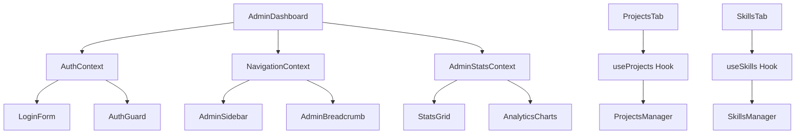

# Design Document

## Overview

The admin dashboard optimization involves restructuring the current monolithic 1260+ line Admin.tsx component into a modular, maintainable, and performant architecture. The design focuses on component decomposition, enhanced layouts, improved state management, and better user experience through optimized UI components and responsive design.

## Architecture

### Component Hierarchy

```
AdminDashboard/
├── layout/
│   ├── AdminLayout.tsx           # Main layout wrapper
│   ├── AdminHeader.tsx           # Header with navigation and user actions
│   ├── AdminSidebar.tsx          # Collapsible sidebar navigation
│   └── AdminBreadcrumb.tsx       # Breadcrumb navigation
├── auth/
│   ├── AdminAuth.tsx             # Authentication wrapper
│   ├── LoginForm.tsx             # Login form component
│   └── AuthGuard.tsx             # Route protection
├── dashboard/
│   ├── DashboardOverview.tsx     # Main dashboard overview
│   ├── StatsGrid.tsx             # Statistics cards grid
│   ├── QuickActions.tsx          # Quick action buttons
│   ├── RecentActivity.tsx        # Recent activity feed
│   └── AnalyticsCharts.tsx       # Charts and analytics
├── projects/
│   ├── ProjectsTab.tsx           # Projects tab container
│   ├── ProjectForm.tsx           # Add/edit project form
│   ├── ProjectCard.tsx           # Individual project card
│   └── ProjectBulkActions.tsx    # Bulk operations
├── skills/
│   ├── SkillsTab.tsx             # Skills tab container
│   ├── SkillForm.tsx             # Add/edit skill form
│   ├── SkillCard.tsx             # Individual skill card
│   └── SkillBulkActions.tsx      # Bulk operations
├── shared/
│   ├── LoadingStates.tsx         # Loading components
│   ├── EmptyStates.tsx           # Empty state components
│   ├── ErrorBoundary.tsx         # Error handling
│   └── ConfirmDialog.tsx         # Confirmation dialogs
└── hooks/
    ├── useAdminAuth.ts           # Authentication logic
    ├── useAdminNavigation.ts     # Navigation state
    ├── useAdminStats.ts          # Statistics calculations
    └── useAdminActions.ts        # Common admin actions
```

### State Management Architecture



## Components and Interfaces

### Core Layout Components

#### AdminLayout.tsx
```typescript
interface AdminLayoutProps {
  children: React.ReactNode;
  sidebarCollapsed?: boolean;
  onSidebarToggle?: () => void;
}

interface LayoutConfig {
  showSidebar: boolean;
  showBreadcrumb: boolean;
  maxWidth: 'full' | '7xl' | '6xl';
  padding: 'sm' | 'md' | 'lg';
}
```

#### AdminHeader.tsx
```typescript
interface AdminHeaderProps {
  user: User | null;
  onLogout: () => void;
  showUserMenu?: boolean;
  actions?: HeaderAction[];
}

interface HeaderAction {
  label: string;
  icon: React.ComponentType;
  onClick: () => void;
  variant?: 'default' | 'outline' | 'ghost';
}
```

### Dashboard Components

#### StatsGrid.tsx
```typescript
interface StatsGridProps {
  stats: AdminStats;
  loading?: boolean;
  columns?: 2 | 3 | 4;
  showTrends?: boolean;
}

interface StatCard {
  title: string;
  value: number | string;
  icon: React.ComponentType;
  color: string;
  trend?: {
    value: number;
    direction: 'up' | 'down' | 'neutral';
  };
  onClick?: () => void;
}
```

#### QuickActions.tsx
```typescript
interface QuickActionsProps {
  actions: QuickAction[];
  layout?: 'grid' | 'list';
  maxItems?: number;
}

interface QuickAction {
  id: string;
  label: string;
  description?: string;
  icon: React.ComponentType;
  onClick: () => void;
  disabled?: boolean;
  badge?: string;
}
```

### Enhanced Form Components

#### ProjectForm.tsx
```typescript
interface ProjectFormProps {
  project?: Project;
  onSubmit: (data: ProjectInput) => Promise<void>;
  onCancel: () => void;
  mode: 'create' | 'edit';
}

interface FormSection {
  title: string;
  description?: string;
  fields: FormField[];
  collapsible?: boolean;
  defaultExpanded?: boolean;
}
```

#### SkillForm.tsx
```typescript
interface SkillFormProps {
  skill?: Skill;
  onSubmit: (data: SkillInput) => Promise<void>;
  onCancel: () => void;
  mode: 'create' | 'edit';
}
```

### Enhanced Data Table

#### AdminDataTable.tsx
```typescript
interface AdminDataTableProps<T> extends DataTableProps<T, unknown> {
  title: string;
  description?: string;
  createButton?: {
    label: string;
    onClick: () => void;
  };
  bulkActions?: BulkAction<T>[];
  exportOptions?: ExportOption<T>[];
  virtualScrolling?: boolean;
  stickyHeader?: boolean;
}

interface BulkAction<T> {
  label: string;
  icon: React.ComponentType;
  onClick: (items: T[]) => void;
  variant?: 'default' | 'destructive';
  requiresConfirmation?: boolean;
}
```

## Data Models

### Enhanced Admin State

```typescript
interface AdminState {
  auth: {
    user: User | null;
    loading: boolean;
    error: string | null;
  };
  navigation: {
    activeTab: string;
    sidebarCollapsed: boolean;
    breadcrumb: BreadcrumbItem[];
  };
  stats: {
    projects: ProjectStats;
    skills: SkillStats;
    loading: boolean;
    lastUpdated: number;
  };
  ui: {
    theme: 'light' | 'dark';
    density: 'compact' | 'comfortable' | 'spacious';
    animations: boolean;
  };
}

interface ProjectStats {
  total: number;
  featured: number;
  active: number;
  categories: number;
  byStatus: Record<ProjectStatus, number>;
  byCategory: Record<ProjectCategory, number>;
  recentActivity: ActivityItem[];
}

interface SkillStats {
  total: number;
  featured: number;
  byCategory: Record<SkillCategory, number>;
  averageLevel: number;
  topSkills: Skill[];
}
```

### Layout Configuration

```typescript
interface ResponsiveConfig {
  breakpoints: {
    mobile: number;
    tablet: number;
    desktop: number;
    wide: number;
  };
  grid: {
    columns: {
      mobile: number;
      tablet: number;
      desktop: number;
    };
    gap: {
      mobile: string;
      tablet: string;
      desktop: string;
    };
  };
}
```

## Error Handling

### Error Boundary Strategy

```typescript
interface AdminErrorBoundaryProps {
  fallback?: React.ComponentType<ErrorFallbackProps>;
  onError?: (error: Error, errorInfo: ErrorInfo) => void;
  resetKeys?: Array<string | number>;
}

interface ErrorFallbackProps {
  error: Error;
  resetError: () => void;
  componentStack?: string;
}
```

### Error Types

```typescript
enum AdminErrorType {
  AUTHENTICATION = 'authentication',
  AUTHORIZATION = 'authorization',
  NETWORK = 'network',
  VALIDATION = 'validation',
  UNKNOWN = 'unknown'
}

interface AdminError {
  type: AdminErrorType;
  message: string;
  details?: Record<string, unknown>;
  timestamp: number;
  recoverable: boolean;
}
```

## Testing Strategy

### Component Testing

1. **Unit Tests**: Each component will have comprehensive unit tests
2. **Integration Tests**: Test component interactions and data flow
3. **Visual Regression Tests**: Ensure UI consistency across changes
4. **Accessibility Tests**: Verify WCAG compliance

### Performance Testing

1. **Bundle Size Analysis**: Monitor component bundle sizes
2. **Render Performance**: Measure component render times
3. **Memory Usage**: Track memory consumption
4. **Load Testing**: Test with large datasets

### Test Structure

```typescript
// Example test structure
describe('AdminDashboard', () => {
  describe('Authentication', () => {
    it('should redirect to login when not authenticated');
    it('should show dashboard when authenticated');
  });
  
  describe('Navigation', () => {
    it('should switch tabs correctly');
    it('should maintain state between tabs');
  });
  
  describe('Data Management', () => {
    it('should load projects correctly');
    it('should handle loading states');
    it('should handle error states');
  });
});
```

## Performance Optimizations

### Code Splitting

```typescript
// Lazy load admin sections
const ProjectsTab = lazy(() => import('./projects/ProjectsTab'));
const SkillsTab = lazy(() => import('./skills/SkillsTab'));
const AnalyticsTab = lazy(() => import('./analytics/AnalyticsTab'));
```

### Memoization Strategy

```typescript
// Memoize expensive calculations
const memoizedStats = useMemo(() => 
  calculateAdminStats(projects, skills), 
  [projects, skills]
);

// Memoize callback functions
const handleProjectUpdate = useCallback((id: string, data: Partial<Project>) => {
  updateProject(id, data);
}, [updateProject]);
```

### Virtual Scrolling

```typescript
interface VirtualScrollConfig {
  itemHeight: number;
  containerHeight: number;
  overscan: number;
  threshold: number;
}
```

## Responsive Design

### Breakpoint Strategy

```css
/* Mobile First Approach */
.admin-grid {
  display: grid;
  grid-template-columns: 1fr;
  gap: 1rem;
}

@media (min-width: 768px) {
  .admin-grid {
    grid-template-columns: repeat(2, 1fr);
    gap: 1.5rem;
  }
}

@media (min-width: 1024px) {
  .admin-grid {
    grid-template-columns: repeat(3, 1fr);
    gap: 2rem;
  }
}

@media (min-width: 1280px) {
  .admin-grid {
    grid-template-columns: repeat(4, 1fr);
  }
}
```

### Layout Adaptations

1. **Mobile**: Single column layout, collapsible sidebar, touch-friendly controls
2. **Tablet**: Two-column layout, persistent sidebar, optimized touch targets
3. **Desktop**: Multi-column layout, full sidebar, hover interactions
4. **Wide Screen**: Maximum content width, additional columns where appropriate

## Accessibility

### WCAG Compliance

1. **Keyboard Navigation**: Full keyboard accessibility
2. **Screen Reader Support**: Proper ARIA labels and descriptions
3. **Color Contrast**: Meet WCAG AA standards
4. **Focus Management**: Clear focus indicators and logical tab order

### Implementation

```typescript
// Example accessibility implementation
interface AccessibilityProps {
  'aria-label'?: string;
  'aria-describedby'?: string;
  'aria-expanded'?: boolean;
  role?: string;
  tabIndex?: number;
}
```

## Migration Strategy

### Phase 1: Core Structure
1. Create new component structure
2. Extract authentication logic
3. Implement basic layout components

### Phase 2: Feature Migration
1. Migrate projects management
2. Migrate skills management
3. Implement enhanced data tables

### Phase 3: Optimization
1. Add performance optimizations
2. Implement responsive design
3. Add accessibility features

### Phase 4: Testing & Polish
1. Comprehensive testing
2. Performance tuning
3. Documentation updates