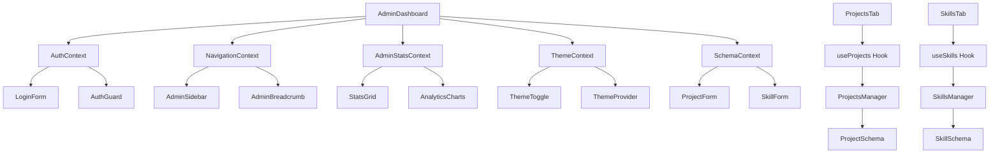

# Design Document

## Overview

The admin dashboard optimization involves restructuring the current monolithic 1260+ line Admin.tsx component into a modular, maintainable, and performant architecture. The design focuses on component decomposition, enhanced layouts, improved state management, and better user experience through optimized UI components and responsive design.

## Architecture

### Component Hierarchy

```
AdminDashboard/
├── layout/
│   ├── AdminLayout.tsx           # Main layout wrapper with theme support
│   ├── AdminHeader.tsx           # Header with navigation and theme toggle
│   ├── AdminSidebar.tsx          # Collapsible sidebar navigation
│   └── AdminBreadcrumb.tsx       # Breadcrumb navigation
├── auth/
│   ├── AdminAuth.tsx             # Authentication wrapper
│   ├── LoginForm.tsx             # Login form component
│   └── AuthGuard.tsx             # Route protection
├── dashboard/
│   ├── DashboardOverview.tsx     # Main dashboard overview
│   ├── StatsGrid.tsx             # Statistics cards grid
│   ├── QuickActions.tsx          # Quick action buttons
│   ├── RecentActivity.tsx        # Recent activity feed
│   └── AnalyticsCharts.tsx       # Charts and analytics
├── projects/
│   ├── ProjectsTab.tsx           # Projects tab container
│   ├── ProjectForm.tsx           # Schema-validated project form
│   ├── ProjectCard.tsx           # Individual project card
│   └── ProjectBulkActions.tsx    # Bulk operations
├── skills/
│   ├── SkillsTab.tsx             # Skills tab container
│   ├── SkillForm.tsx             # Schema-validated skill form
│   ├── SkillCard.tsx             # Individual skill card
│   └── SkillBulkActions.tsx      # Bulk operations
├── theme/
│   ├── ThemeProvider.tsx         # Theme context provider
│   ├── ThemeToggle.tsx           # Theme switcher component
│   ├── themes.ts                 # Theme definitions
│   └── useTheme.ts               # Theme management hook
├── schema/
│   ├── projectSchema.ts          # Project data validation schema
│   ├── skillSchema.ts            # Skill data validation schema
│   ├── validators.ts             # Shared validation utilities
│   └── types.ts                  # TypeScript type definitions
├── shared/
│   ├── LoadingStates.tsx         # Loading components
│   ├── EmptyStates.tsx           # Empty state components
│   ├── ErrorBoundary.tsx         # Error handling
│   ├── ConfirmDialog.tsx         # Confirmation dialogs
│   └── AnimatedComponents.tsx    # Reusable animated components
├── utils/
│   ├── performance.ts            # Performance optimization utilities
│   ├── deduplication.ts          # Code deduplication helpers
│   ├── modernFeatures.ts         # Modern JS/CSS feature detection
│   └── constants.ts              # Shared constants
└── hooks/
    ├── useAdminAuth.ts           # Authentication logic
    ├── useAdminNavigation.ts     # Navigation state
    ├── useAdminStats.ts          # Statistics calculations
    ├── useAdminActions.ts        # Common admin actions
    ├── useSchemaValidation.ts    # Schema validation hook
    └── usePerformanceMonitor.ts  # Performance monitoring
```

### State Management Architecture



## Components and Interfaces

### Core Layout Components

#### AdminLayout.tsx
```typescript
interface AdminLayoutProps {
  children: React.ReactNode;
  sidebarCollapsed?: boolean;
  onSidebarToggle?: () => void;
}

interface LayoutConfig {
  showSidebar: boolean;
  showBreadcrumb: boolean;
  maxWidth: 'full' | '7xl' | '6xl';
  padding: 'sm' | 'md' | 'lg';
}
```

#### AdminHeader.tsx
```typescript
interface AdminHeaderProps {
  user: User | null;
  onLogout: () => void;
  showUserMenu?: boolean;
  actions?: HeaderAction[];
}

interface HeaderAction {
  label: string;
  icon: React.ComponentType;
  onClick: () => void;
  variant?: 'default' | 'outline' | 'ghost';
}
```

### Dashboard Components

#### StatsGrid.tsx
```typescript
interface StatsGridProps {
  stats: AdminStats;
  loading?: boolean;
  columns?: 2 | 3 | 4;
  showTrends?: boolean;
}

interface StatCard {
  title: string;
  value: number | string;
  icon: React.ComponentType;
  color: string;
  trend?: {
    value: number;
    direction: 'up' | 'down' | 'neutral';
  };
  onClick?: () => void;
}
```

#### QuickActions.tsx
```typescript
interface QuickActionsProps {
  actions: QuickAction[];
  layout?: 'grid' | 'list';
  maxItems?: number;
}

interface QuickAction {
  id: string;
  label: string;
  description?: string;
  icon: React.ComponentType;
  onClick: () => void;
  disabled?: boolean;
  badge?: string;
}
```

### Enhanced Form Components

#### ProjectForm.tsx
```typescript
interface ProjectFormProps {
  project?: Project;
  onSubmit: (data: ProjectInput) => Promise<void>;
  onCancel: () => void;
  mode: 'create' | 'edit';
}

interface FormSection {
  title: string;
  description?: string;
  fields: FormField[];
  collapsible?: boolean;
  defaultExpanded?: boolean;
}
```

#### SkillForm.tsx
```typescript
interface SkillFormProps {
  skill?: Skill;
  onSubmit: (data: SkillInput) => Promise<void>;
  onCancel: () => void;
  mode: 'create' | 'edit';
}
```

### Enhanced Data Table

#### AdminDataTable.tsx
```typescript
interface AdminDataTableProps<T> extends DataTableProps<T, unknown> {
  title: string;
  description?: string;
  createButton?: {
    label: string;
    onClick: () => void;
  };
  bulkActions?: BulkAction<T>[];
  exportOptions?: ExportOption<T>[];
  virtualScrolling?: boolean;
  stickyHeader?: boolean;
}

interface BulkAction<T> {
  label: string;
  icon: React.ComponentType;
  onClick: (items: T[]) => void;
  variant?: 'default' | 'destructive';
  requiresConfirmation?: boolean;
}
```

## Data Models

### Enhanced Admin State

```typescript
interface AdminState {
  auth: {
    user: User | null;
    loading: boolean;
    error: string | null;
  };
  navigation: {
    activeTab: string;
    sidebarCollapsed: boolean;
    breadcrumb: BreadcrumbItem[];
  };
  stats: {
    projects: ProjectStats;
    skills: SkillStats;
    loading: boolean;
    lastUpdated: number;
  };
  ui: {
    theme: 'light' | 'dark';
    density: 'compact' | 'comfortable' | 'spacious';
    animations: boolean;
  };
}

interface ProjectStats {
  total: number;
  featured: number;
  active: number;
  categories: number;
  byStatus: Record<ProjectStatus, number>;
  byCategory: Record<ProjectCategory, number>;
  recentActivity: ActivityItem[];
}

interface SkillStats {
  total: number;
  featured: number;
  byCategory: Record<SkillCategory, number>;
  averageLevel: number;
  topSkills: Skill[];
}
```

### Layout Configuration

```typescript
interface ResponsiveConfig {
  breakpoints: {
    mobile: number;
    tablet: number;
    desktop: number;
    wide: number;
  };
  grid: {
    columns: {
      mobile: number;
      tablet: number;
      desktop: number;
    };
    gap: {
      mobile: string;
      tablet: string;
      desktop: string;
    };
  };
}
```

## Error Handling

### Error Boundary Strategy

```typescript
interface AdminErrorBoundaryProps {
  fallback?: React.ComponentType<ErrorFallbackProps>;
  onError?: (error: Error, errorInfo: ErrorInfo) => void;
  resetKeys?: Array<string | number>;
}

interface ErrorFallbackProps {
  error: Error;
  resetError: () => void;
  componentStack?: string;
}
```

### Error Types

```typescript
enum AdminErrorType {
  AUTHENTICATION = 'authentication',
  AUTHORIZATION = 'authorization',
  NETWORK = 'network',
  VALIDATION = 'validation',
  UNKNOWN = 'unknown'
}

interface AdminError {
  type: AdminErrorType;
  message: string;
  details?: Record<string, unknown>;
  timestamp: number;
  recoverable: boolean;
}
```

## Testing Strategy

### Component Testing

1. **Unit Tests**: Each component will have comprehensive unit tests
2. **Integration Tests**: Test component interactions and data flow
3. **Visual Regression Tests**: Ensure UI consistency across changes
4. **Accessibility Tests**: Verify WCAG compliance

### Performance Testing

1. **Bundle Size Analysis**: Monitor component bundle sizes
2. **Render Performance**: Measure component render times
3. **Memory Usage**: Track memory consumption
4. **Load Testing**: Test with large datasets

### Test Structure

```typescript
// Example test structure
describe('AdminDashboard', () => {
  describe('Authentication', () => {
    it('should redirect to login when not authenticated');
    it('should show dashboard when authenticated');
  });
  
  describe('Navigation', () => {
    it('should switch tabs correctly');
    it('should maintain state between tabs');
  });
  
  describe('Data Management', () => {
    it('should load projects correctly');
    it('should handle loading states');
    it('should handle error states');
  });
});
```

## Performance Optimizations

### Code Splitting

```typescript
// Lazy load admin sections
const ProjectsTab = lazy(() => import('./projects/ProjectsTab'));
const SkillsTab = lazy(() => import('./skills/SkillsTab'));
const AnalyticsTab = lazy(() => import('./analytics/AnalyticsTab'));
```

### Memoization Strategy

```typescript
// Memoize expensive calculations
const memoizedStats = useMemo(() => 
  calculateAdminStats(projects, skills), 
  [projects, skills]
);

// Memoize callback functions
const handleProjectUpdate = useCallback((id: string, data: Partial<Project>) => {
  updateProject(id, data);
}, [updateProject]);
```

### Virtual Scrolling

```typescript
interface VirtualScrollConfig {
  itemHeight: number;
  containerHeight: number;
  overscan: number;
  threshold: number;
}
```

## Responsive Design

### Breakpoint Strategy

```css
/* Mobile First Approach */
.admin-grid {
  display: grid;
  grid-template-columns: 1fr;
  gap: 1rem;
}

@media (min-width: 768px) {
  .admin-grid {
    grid-template-columns: repeat(2, 1fr);
    gap: 1.5rem;
  }
}

@media (min-width: 1024px) {
  .admin-grid {
    grid-template-columns: repeat(3, 1fr);
    gap: 2rem;
  }
}

@media (min-width: 1280px) {
  .admin-grid {
    grid-template-columns: repeat(4, 1fr);
  }
}
```

### Layout Adaptations

1. **Mobile**: Single column layout, collapsible sidebar, touch-friendly controls
2. **Tablet**: Two-column layout, persistent sidebar, optimized touch targets
3. **Desktop**: Multi-column layout, full sidebar, hover interactions
4. **Wide Screen**: Maximum content width, additional columns where appropriate

## Accessibility

### WCAG Compliance

1. **Keyboard Navigation**: Full keyboard accessibility
2. **Screen Reader Support**: Proper ARIA labels and descriptions
3. **Color Contrast**: Meet WCAG AA standards
4. **Focus Management**: Clear focus indicators and logical tab order

### Implementation

```typescript
// Example accessibility implementation
interface AccessibilityProps {
  'aria-label'?: string;
  'aria-describedby'?: string;
  'aria-expanded'?: boolean;
  role?: string;
  tabIndex?: number;
}
```

## Migration Strategy

### Phase 1: Core Structure
1. Create new component structure
2. Extract authentication logic
3. Implement basic layout components

### Phase 2: Feature Migration
1. Migrate projects management
2. Migrate skills management
3. Implement enhanced data tables

### Phase 3: Optimization
1. Add performance optimizations
2. Implement responsive design
3. Add accessibility features

### Phase 4: Testing & Polish
1. Comprehensive testing
2. Performance tuning
3. Documentation updates
## Da
tabase Schema Design

### Project Schema

```typescript
interface ProjectSchema {
  id: string;
  title: string;
  description: string;
  longDescription?: string;
  technologies: string[];
  category: ProjectCategory;
  status: ProjectStatus;
  priority: ProjectPriority;
  featured: boolean;
  images: ProjectImage[];
  links: ProjectLink[];
  metrics: ProjectMetrics;
  dates: {
    created: Date;
    updated: Date;
    started?: Date;
    completed?: Date;
  };
  tags: string[];
  visibility: 'public' | 'private' | 'draft';
  seo: {
    slug: string;
    metaTitle?: string;
    metaDescription?: string;
    keywords: string[];
  };
}

enum ProjectCategory {
  WEB_DEVELOPMENT = 'web-development',
  MOBILE_APP = 'mobile-app',
  DESKTOP_APP = 'desktop-app',
  API_BACKEND = 'api-backend',
  DEVOPS = 'devops',
  DATA_SCIENCE = 'data-science',
  DESIGN = 'design',
  OTHER = 'other'
}

enum ProjectStatus {
  PLANNING = 'planning',
  IN_PROGRESS = 'in-progress',
  COMPLETED = 'completed',
  ON_HOLD = 'on-hold',
  CANCELLED = 'cancelled'
}

enum ProjectPriority {
  LOW = 'low',
  MEDIUM = 'medium',
  HIGH = 'high',
  CRITICAL = 'critical'
}
```

### Skill Schema

```typescript
interface SkillSchema {
  id: string;
  name: string;
  category: SkillCategory;
  level: SkillLevel;
  experience: {
    years: number;
    months: number;
  };
  proficiency: number; // 0-100
  featured: boolean;
  description?: string;
  certifications: Certification[];
  projects: string[]; // Project IDs
  icon?: string;
  color?: string;
  tags: string[];
  learningPath: {
    resources: LearningResource[];
    milestones: Milestone[];
  };
  dates: {
    created: Date;
    updated: Date;
    firstUsed?: Date;
    lastUsed?: Date;
  };
  visibility: 'public' | 'private';
}

enum SkillCategory {
  PROGRAMMING_LANGUAGES = 'programming-languages',
  FRAMEWORKS = 'frameworks',
  DATABASES = 'databases',
  TOOLS = 'tools',
  CLOUD_SERVICES = 'cloud-services',
  DESIGN = 'design',
  SOFT_SKILLS = 'soft-skills',
  OTHER = 'other'
}

enum SkillLevel {
  BEGINNER = 'beginner',
  INTERMEDIATE = 'intermediate',
  ADVANCED = 'advanced',
  EXPERT = 'expert'
}
```

## Theme System Design

### Theme Architecture

```typescript
interface ThemeConfig {
  name: string;
  displayName: string;
  colors: {
    primary: ColorPalette;
    secondary: ColorPalette;
    accent: ColorPalette;
    neutral: ColorPalette;
    semantic: SemanticColors;
  };
  typography: TypographyConfig;
  spacing: SpacingConfig;
  shadows: ShadowConfig;
  animations: AnimationConfig;
  components: ComponentThemeConfig;
}

interface ColorPalette {
  50: string;
  100: string;
  200: string;
  300: string;
  400: string;
  500: string;
  600: string;
  700: string;
  800: string;
  900: string;
  950: string;
}

interface SemanticColors {
  success: ColorPalette;
  warning: ColorPalette;
  error: ColorPalette;
  info: ColorPalette;
}

interface ThemeContextValue {
  theme: 'light' | 'dark' | 'system';
  setTheme: (theme: 'light' | 'dark' | 'system') => void;
  resolvedTheme: 'light' | 'dark';
  systemTheme: 'light' | 'dark';
  toggleTheme: () => void;
}
```

### CSS Custom Properties Strategy

```css
:root {
  /* Light theme colors */
  --color-primary-50: 240 249 255;
  --color-primary-500: 59 130 246;
  --color-primary-900: 30 58 138;
  
  /* Semantic colors */
  --color-background: 255 255 255;
  --color-foreground: 15 23 42;
  --color-muted: 248 250 252;
  --color-border: 226 232 240;
  
  /* Component-specific */
  --admin-header-bg: var(--color-background);
  --admin-sidebar-bg: var(--color-muted);
  --admin-card-bg: var(--color-background);
}

[data-theme="dark"] {
  /* Dark theme overrides */
  --color-background: 15 23 42;
  --color-foreground: 248 250 252;
  --color-muted: 30 41 59;
  --color-border: 51 65 85;
}
```

## Modern Performance Solutions

### Bundle Optimization

```typescript
// Vite configuration for modern bundling
export default defineConfig({
  build: {
    target: 'esnext',
    minify: 'esbuild',
    rollupOptions: {
      output: {
        manualChunks: {
          vendor: ['react', 'react-dom'],
          admin: ['./src/components/admin'],
          ui: ['@radix-ui/react-dialog', '@radix-ui/react-dropdown-menu'],
        },
      },
    },
  },
  optimizeDeps: {
    include: ['react', 'react-dom'],
    exclude: ['@vite/client', '@vite/env'],
  },
});
```

### Image Optimization

```typescript
interface OptimizedImageProps {
  src: string;
  alt: string;
  width?: number;
  height?: number;
  priority?: boolean;
  placeholder?: 'blur' | 'empty';
  formats?: ('webp' | 'avif' | 'jpg' | 'png')[];
}

// Modern image component with next-gen formats
const OptimizedImage: React.FC<OptimizedImageProps> = ({
  src,
  alt,
  width,
  height,
  priority = false,
  formats = ['avif', 'webp', 'jpg'],
}) => {
  return (
    <picture>
      {formats.map(format => (
        <source
          key={format}
          srcSet={generateSrcSet(src, format)}
          type={`image/${format}`}
        />
      ))}
      
    </picture>
  );
};
```

### Code Splitting Strategy

```typescript
// Route-based code splitting
const AdminDashboard = lazy(() => import('./pages/AdminDashboard'));
const ProjectsPage = lazy(() => import('./pages/ProjectsPage'));
const SkillsPage = lazy(() => import('./pages/SkillsPage'));

// Component-based code splitting
const HeavyChart = lazy(() => import('./components/HeavyChart'));
const DataVisualization = lazy(() => import('./components/DataVisualization'));

// Dynamic imports for utilities
const loadAnalytics = () => import('./utils/analytics');
const loadExportUtils = () => import('./utils/export');
```

## Professional UI Enhancement

### Design System

```typescript
interface DesignTokens {
  colors: {
    brand: ColorScale;
    neutral: ColorScale;
    semantic: SemanticColorScale;
  };
  typography: {
    fontFamilies: FontFamilyConfig;
    fontSizes: FontSizeScale;
    fontWeights: FontWeightScale;
    lineHeights: LineHeightScale;
  };
  spacing: SpacingScale;
  borderRadius: BorderRadiusScale;
  shadows: ShadowScale;
  transitions: TransitionConfig;
}

interface AnimationConfig {
  durations: {
    fast: string;
    normal: string;
    slow: string;
  };
  easings: {
    easeInOut: string;
    easeOut: string;
    easeIn: string;
    bounce: string;
  };
  presets: {
    fadeIn: string;
    slideUp: string;
    scaleIn: string;
    slideInRight: string;
  };
}
```

### Micro-interactions

```typescript
interface MicroInteractionConfig {
  hover: {
    scale: number;
    duration: string;
    easing: string;
  };
  focus: {
    ringWidth: string;
    ringColor: string;
    ringOffset: string;
  };
  active: {
    scale: number;
    duration: string;
  };
  loading: {
    animation: string;
    duration: string;
  };
}

// Framer Motion variants for consistent animations
export const cardVariants = {
  hidden: { opacity: 0, y: 20 },
  visible: { 
    opacity: 1, 
    y: 0,
    transition: { duration: 0.3, ease: "easeOut" }
  },
  hover: { 
    y: -4,
    boxShadow: "0 10px 25px rgba(0,0,0,0.1)",
    transition: { duration: 0.2 }
  }
};
```

## Code Deduplication Strategy

### Shared Utilities

```typescript
// Centralized utility functions
export const formatters = {
  date: (date: Date) => new Intl.DateTimeFormat('en-US').format(date),
  currency: (amount: number) => new Intl.NumberFormat('en-US', { 
    style: 'currency', 
    currency: 'USD' 
  }).format(amount),
  percentage: (value: number) => `${Math.round(value * 100)}%`,
};

// Shared validation functions
export const validators = {
  email: (email: string) => /^[^\s@]+@[^\s@]+\.[^\s@]+$/.test(email),
  url: (url: string) => {
    try { new URL(url); return true; } 
    catch { return false; }
  },
  required: (value: any) => value != null && value !== '',
};

// Shared API utilities
export const apiUtils = {
  handleResponse: async (response: Response) => {
    if (!response.ok) throw new Error(`HTTP ${response.status}`);
    return response.json();
  },
  createHeaders: (token?: string) => ({
    'Content-Type': 'application/json',
    ...(token && { Authorization: `Bearer ${token}` }),
  }),
};
```

### Component Composition

```typescript
// Base components for composition
interface BaseCardProps {
  children: React.ReactNode;
  variant?: 'default' | 'outlined' | 'elevated';
  padding?: 'sm' | 'md' | 'lg';
  className?: string;
}

const BaseCard: React.FC<BaseCardProps> = ({ 
  children, 
  variant = 'default',
  padding = 'md',
  className 
}) => {
  return (
    <div className={cn(
      'rounded-lg border',
      cardVariants[variant],
      paddingVariants[padding],
      className
    )}>
      {children}
    </div>
  );
};

// Composed components
const ProjectCard = (props: ProjectCardProps) => (
  <BaseCard variant="elevated" padding="lg">
    <ProjectCardContent {...props} />
  </BaseCard>
);

const SkillCard = (props: SkillCardProps) => (
  <BaseCard variant="outlined" padding="md">
    <SkillCardContent {...props} />
  </BaseCard>
);
```